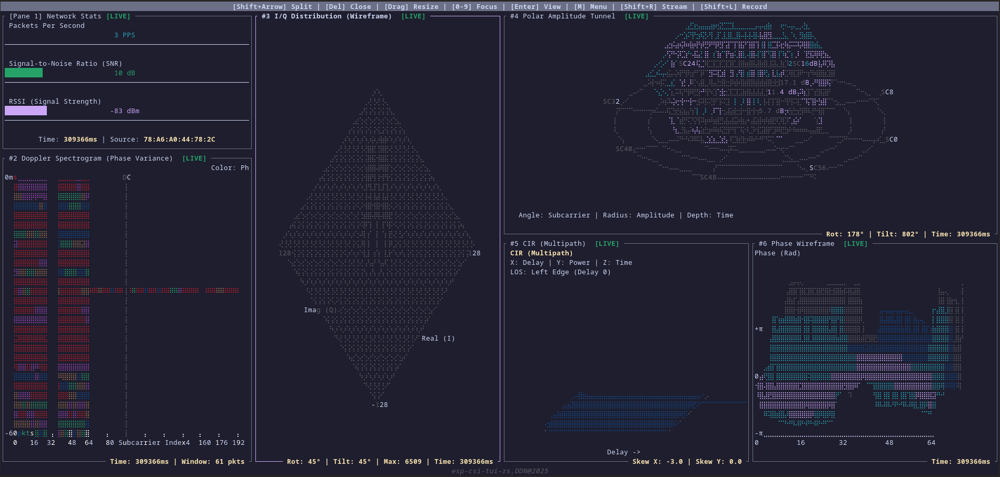
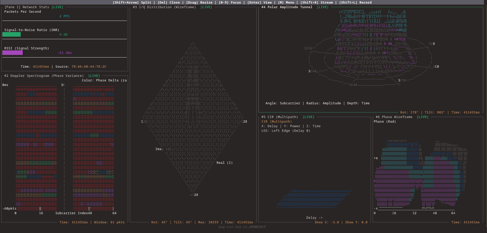
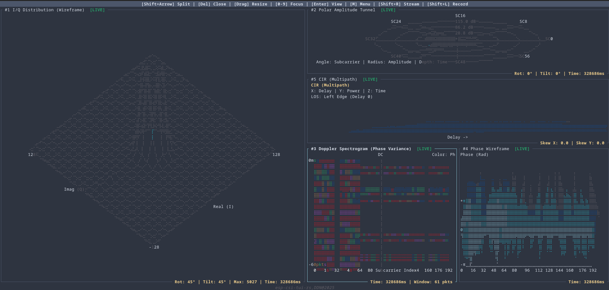
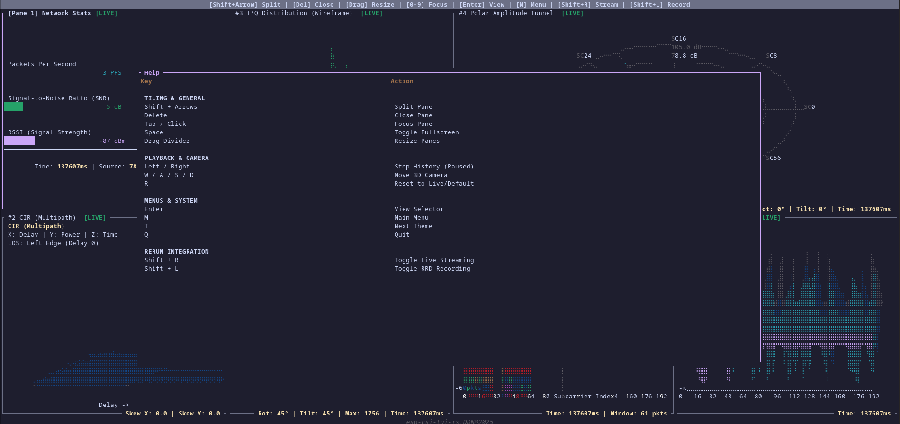

# ESP CSI TUI RS

A TUI-based visualization tool for ESP32 CSI (Channel State Information) data.







## Table of Contents
- [Prerequisites](#prerequisites)
- [Running](#running)
- [Troubleshooting](#troubleshooting)
- [Features](#features)
- [Technologies Used](#technologies-used)

## Prerequisites

You need an ESP32 device flashed with the `csi-cli` binary.
You can find the firmware and flashing instructions here:
[esp-csi-cli-rs](https://github.com/Connected-Motion-Research/esp-csi-cli-rs/tree/master)

## Running

Simply run the application with cargo:

```bash
cargo run --release
```

## Troubleshooting

If you encounter issues with data reception:

1.  **In-App Reset**: Open the Main Menu (`m`) and select "Reset ESP".
2.  **Manual Reset**: If that fails, you can manually reset the ESP driver:
    ```bash
    espflash monitor
    # Press Ctrl+R to reset
    ```

## Features

### Core Functionality
- **Tiling Window Manager**: Fully customizable layout with support for splitting panes horizontally and vertically.
- **Theming**: Built-in support for multiple color schemes (Dark, Light, Nordic, Gruvbox, Catppuccin).
- **Templates**: Save and load your favorite layouts and theme configurations.
- **Rerun Integration**: Stream live CSI data to [Rerun.io](https://rerun.io/) for advanced 3D visualization.
- **Data Export**: Export captured CSI history to CSV format.
- **Replay Mode**: Load CSV files to replay and analyze historical data offline.

## Technologies Used

### Visualized Plots
- **2.5D Phase Angle Visualization**
- **3D Cylindrical View** of Amplitude vs Subcarrier History
- **3D Multipoint Scatter Wireframe** of CSI data in frequency domain
- **2D Doppler Spectrogram** of Phase Velocity over Variance
- **Dashboard** of signal stats and quality
- **3D Isometric Plot** of the CIR (Channel Impulse Response)


### Overview
**esp-csi-tui-rs** is a TUI program built with Rust using MVC architecture. Its main purpose is to establish a connection with an ESP32 device via the serial port to read CSI output, process the waves captured by the ESP32 in parallel using multiple threads, and visualize different plots in real-time. It also supports replaying previously recorded data. Its primary usage is to understand the surrounding environment using electromagnetic waves, which are medium-less but affected by the environment around them, offering high range and low transmission cost.

### Tech Stack
- **Programming Language**: Rust
- **ESP32 ELF**: [esp-csi-cli-rs](https://github.com/Connected-Motion-Research/esp-csi-cli-rs)

### Libraries & Crates
- **Ratatui**: For terminal user interface.
- **Crossterm**: Terminal manipulation.
- **Serde**: Serializing and deserializing data; used to save UI templates/configurations into JSON files.
- **RustFFT**: SIMD-accelerated FFT library.
- **Rerun**: Visualization for spatial and embodied AI.
- **Serialport**: I/O interface for reading from tty.
